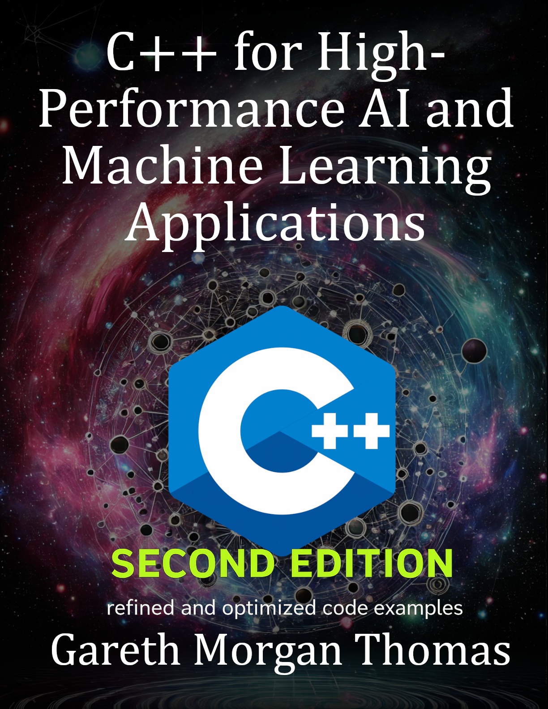

# C Plus Plus For High Performance Ai And Machine Learning Applications

### Cover

### Repository Structure
- `covers/`: Book cover images
- `blurbs/`: Promotional blurbs
- `infographics/`: Marketing visuals
- `source_code/`: Code samples
- `manuscript/`: Drafts and format.txt for TOC
- `marketing/`: Ads and press releases
- `additional_resources/`: Extras

View the live site at [burstbookspublishing.github.io/c-plus-plus-for-high-performance-ai-and-machine-learning-applications](https://burstbookspublishing.github.io/c-plus-plus-for-high-performance-ai-and-machine-learning-applications/)
---

- C++ for High-Performance AI and Machine Learning Applications
- Optimizing Computational Efficiency for Cutting-Edge AI Solutions

---
## Chapter 1. Introduction to C++ in AI and Machine Learning
### Section 1. Overview of AI and Machine Learning in C++
- The Role of C++ in AI Development
- Performance Advantages of C++ for AI
- Case Studies of AI Applications in C++

### Section 2. Setting Up the Development Environment
- Choosing the Right Compiler and IDE for AI Projects
- Installing Essential Libraries (Eigen, TensorFlow, PyTorch C++ API)
- Compiling and Running C++ AI Programs

### Section 3. C++ Language Essentials for AI
- Key Features of Modern C++ for AI Applications
- Introduction to STL for Data Handling
- Memory Management and Efficiency in AI

---
## Chapter 2. Fundamentals of Machine Learning
### Section 1. Basic Concepts of Machine Learning
- Types of Machine Learning: Supervised, Unsupervised, Reinforcement Learning
- Key Algorithms: Linear Regression, Decision Trees, K-Means Clustering
- Evaluating Machine Learning Models

### Section 2. Mathematical Foundations
- Linear Algebra Essentials for ML
- Probability and Statistics in Machine Learning
- Calculus and Optimization Techniques

### Section 3. Implementing Basic Algorithms in C++
- Coding Linear Regression from Scratch
- Implementing K-Means Clustering
- Creating a Simple Decision Tree Classifier

---
## Chapter 3. Data Handling and Processing in C++
### Section 1. Data Preprocessing Techniques
- Data Cleaning and Transformation
- Handling Missing Values and Outliers
- Normalization and Standardization

### Section 2. Working with Large Datasets
- Memory Management for Large Data
- Using Data Structures Efficiently
- Loading and Parsing Data from Files

### Section 3. Parallel Processing for Data Preparation
- Multithreading Basics for Data Processing
- Using OpenMP for Parallel Processing
- Optimizing Data Pipelines for Performance

---
## Chapter 4. Neural Networks and Deep Learning
### Section 1. Fundamentals of Neural Networks
- Neurons, Layers, and Activation Functions
- Forward and Backpropagation
- Training a Neural Network

### Section 2. Implementing Neural Networks in C++
- Building a Simple Neural Network from Scratch
- Using Matrix Operations for Efficiency
- Implementing Backpropagation and Gradient Descent

### Section 3. Advanced Neural Network Architectures
- Convolutional Neural Networks (CNNs)
- Recurrent Neural Networks (RNNs)
- Transfer Learning and Pretrained Models

---
## Chapter 5. Integrating C++ with Popular AI Libraries
### Section 1. TensorFlow and PyTorch C++ APIs
- Setting Up TensorFlow and PyTorch in C++
- Building and Training Models Using TensorFlow C++ API
- Using PyTorch’s C++ Frontend for High-Performance Applications

### Section 2. Working with OpenCV for Computer Vision
- Basics of Image Processing in OpenCV
- Using OpenCV with Neural Networks
- Real-Time Computer Vision Applications in C++

### Section 3. Data Management with Apache Arrow and Datasets
- Overview of Apache Arrow for Data Handling
- Efficient Data Serialization with Arrow
- Integrating Arrow with C++ AI Pipelines

---
## Chapter 6. High-Performance Computing in AI
### Section 1. Optimizing C++ Code for AI
- Profiling and Benchmarking C++ Code
- Using Compiler Optimizations and Vectorization
- Writing Cache-Efficient Code

### Section 2. GPU Programming with CUDA
- Introduction to GPU Programming for AI
- Setting Up and Using CUDA in C++
- Parallelizing Neural Network Operations on GPUs

### Section 3. Distributed Computing for Large-Scale AI
- Basics of Distributed Computing with MPI
- Scaling AI Workloads Across Multiple Machines
- Implementing Distributed Neural Networks

---
## Chapter 7. Reinforcement Learning in C++
### Section 1. Basics of Reinforcement Learning
- Concepts of Agent, Environment, and Reward
- Q-Learning and Deep Q-Networks
- Policy-Based Methods

### Section 2. Implementing Reinforcement Learning Algorithms
- Coding Q-Learning from Scratch
- Building a Simple Environment for Testing
- Implementing a DQN Using C++

### Section 3. Reinforcement Learning Libraries in C++
- Using RL Libraries in C++
- OpenAI Gym Integration with C++
- Case Study: Reinforcement Learning Application

---
## Chapter 8. Real-World AI Projects in C++
### Section 1. Building a Recommendation System
- Collaborative Filtering and Content-Based Filtering
- Implementing a Recommender System in C++
- Optimizing for Scalability and Speed

### Section 2. Developing a Sentiment Analysis Tool
- Basics of Natural Language Processing (NLP)
- Training and Testing Sentiment Models
- Deploying an NLP Model in C++

### Section 3. Autonomous Driving and Robotics
- Basics of Autonomous Systems
- Sensor Data Processing and Analysis
- Building an Autonomous System Prototype in C++

---
## Chapter 9. Model Optimization and Deployment
### Section 1. Quantization and Model Compression
- Reducing Model Size with Quantization
- Pruning Techniques to Improve Performance
- Case Study: Optimizing a Neural Network

### Section 2. Model Deployment in Production Environments
- Packaging and Deployment Best Practices
- Integrating AI Models into C++ Applications
- Deployment on Edge Devices and Embedded Systems

### Section 3. Monitoring and Maintenance of AI Models
- Model Monitoring and Drift Detection
- Continuous Model Improvement
- Logging and Analytics for AI in Production

---
## Chapter 10. Best Practices and Design Patterns for AI in C++
### Section 1. Code Quality and Maintainability
- Coding Standards for AI Projects
- Refactoring and Modularization
- Documentation and Code Reviews

### Section 2. Design Patterns for AI Systems
- Singleton, Factory, and Strategy Patterns in AI
- Adapter and Observer Patterns for Flexibility
- Best Practices in AI System Design

### Section 3. Advanced Software Engineering for AI
- Testing and Debugging AI Applications
- Performance Optimization Strategies
- Security and Privacy in AI Models
---
